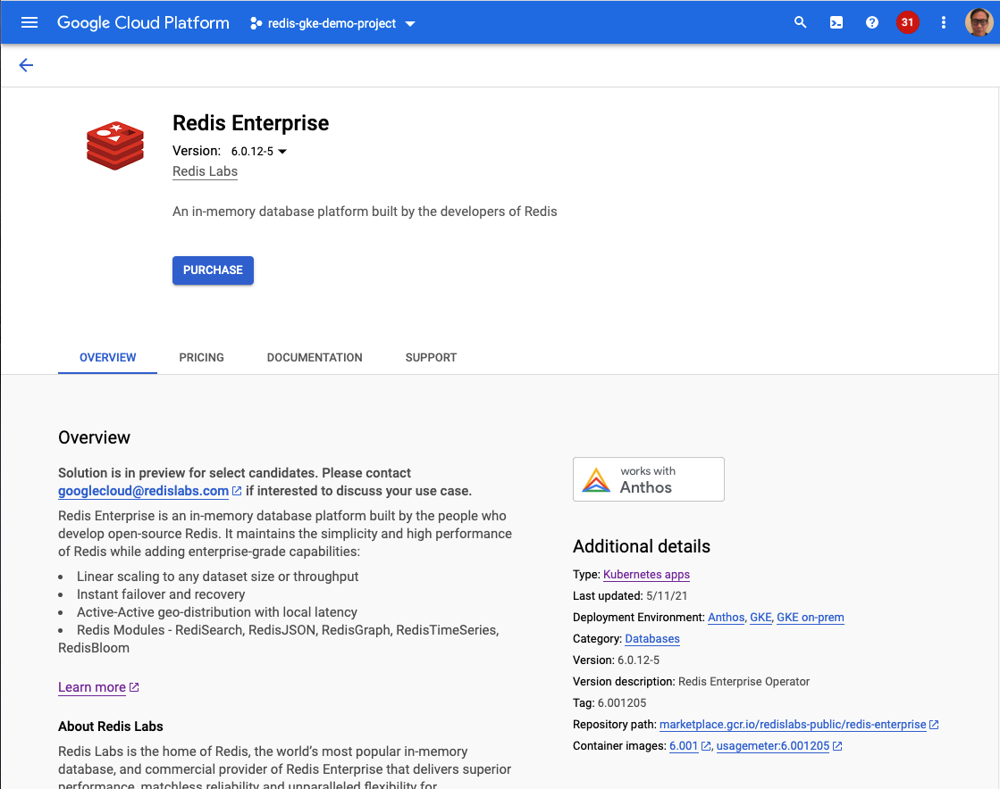
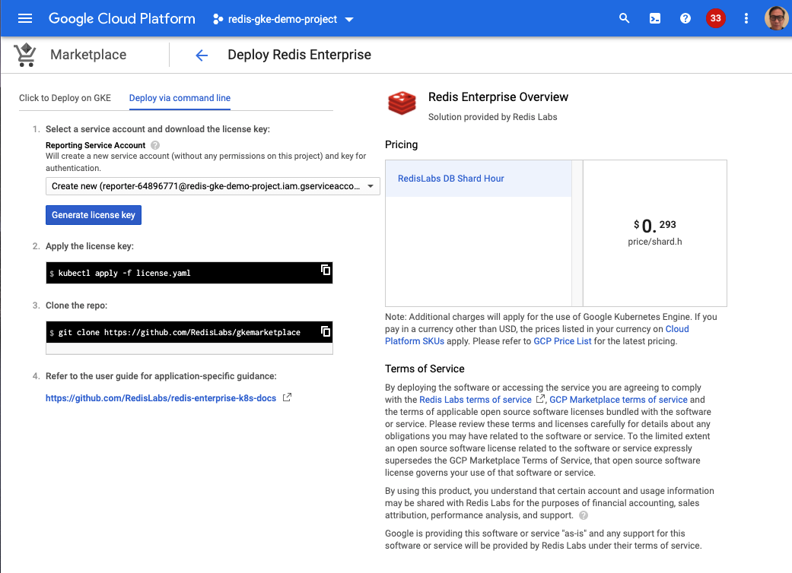

# Overview

This document describes the installation process for [Redis Enterprise](https://github.com/RedisLabs/redis-enterprise-k8s-docs) via Google Cloud Marketplace. There are two ways to install Redis Enterprise in GKE, one using GCP Console UI and using CLI.  

## Quick install with Google Cloud Marketplace (from GKE Console)

Get up and running with a few clicks! Install this Redis Enterprise app to a
Google Kubernetes Engine cluster using Google Cloud Marketplace. You can do this from the Applications tab in the [GKE listing page](https://console.cloud.google.com/marketplace/product/redislabs-public/redis-enterprise) in the Cloud Console.

## Manual install (CLI)

### Set up command-line tools

You'll need the following tools in your development environment:

- [gcloud](https://cloud.google.com/sdk/gcloud/)
- [kubectl](https://kubernetes.io/docs/reference/kubectl/overview/)
- [docker](https://docs.docker.com/install/)
- [git](https://git-scm.com/book/en/v2/Getting-Started-Installing-Git)
- [helm](https://helm.sh/docs/intro/install/)

Configure `gcloud` as a Docker credential helper:

```shell
gcloud auth login
gcloud auth configure-docker
```

### Obtain license key from Google Cloud Marketplace
!! Not to be confused with the Redis license, which you would receive from Redis. This license key simply enables the pay as you go billing integration into your GKE account!!

#### Purchase Redis Enterprise on GKE via GCP MP in a GCP project

See the following screenshot for an example



#### Generate a license file for the GCP project for the subscription entitlement for billing

See the following screenshot for an example. Click the “Generate license key” button to generate the license key.  It will automatically be downloaded onto your computer. 



Save the license key file preferably as ```license-key.yaml```.

!! Reminder, not to be confused with the Redis license, which you would receive from Redis. This license key simply enables the pay as you go billing integration into your GKE account!!

### Permissions

Users who build and deploy the solution would need "Kubernetes Engine Admin" and "Editor" permissions.

### Create (or use an existing) Google Kubernetes Engine cluster

Redis Enterprise requires at least 5 CPUs and 16GB RAM for each worker node. If you already have an existing cluster that matches the CPU and memory requirements, then skip this step. If not, create a new GKE cluster that matches this specification. See below for an example

```shell
export CLUSTER=redis-cluster
export ZONE=us-west1-a
gcloud container clusters create $CLUSTER --zone $ZONE --machine-type n2-standard-8
```

```shell
gcloud container clusters get-credentials "$CLUSTER" --zone "$ZONE"
```
Create a namespace where redis cluster and database should be created

```shell
kubectl create namespace redis
```

```shell
kubectl config set-context --current --namespace=redis
```

### Clone the repo 

```shell
git clone https://github.com/RedisLabs/gkemarketplace
```


### Prepare Environment variables

---
**NOTE**

Redis version tags are in the format Major.Minor.Patch-Sub but GKE Marketplace requires only Major.Minor, so in order to convert Redis version label to Marketplace use zero padded minor, patch and sub. For example: Redis version 6.0.12-05 would become Marketplace version (DEPLOYER_TAG) 6.001205  

---

```shell
export APP_INSTANCE_NAME=redis-enterprise-operator
export NAMESPACE=redis
export TAG=7.0.22-15
export DEPLOYER_TAG=7.22015
export REPO=gcr.io/cloud-marketplace/redislabs-public/redis-enterprise
```

### Prepare License Key

The license key is a Kubernetes secret, add a metadata.name for set to application instance name (see APP_INSTANCE_NAME env variable) with a suffix “-reportingsecret” (exactly). For example, if instance name is ```redis-enterprise-operator``` then reporting secret ```metadata.name``` must be ```redis-enterprise-operator-reportingsecret```.


For Development and Testing (get fake_reporting_secret.yaml from GCS first) and then modify the metadata.name

```shell
gsutil cp gs://cloud-marketplace-tools/reporting_secrets/fake_reporting_secret.yaml .
```

For Development (fake_reporting_secret.yaml) or Production (license-key.yaml) add the following to yaml after the apiVersion line

```yaml
metadata:
  name: redis-enterprise-operator-reportingsecret
```

### Create Roles, RoleBindings and ServiceAccount

Create namespaced roles (for the redis namespace ) and service account. Note the service account name, which you need for creating cluster roles.
```
kubectl apply -f https://raw.githubusercontent.com/RedisLabs/redis-enterprise-k8s-docs/master/role.yaml
kubectl apply -f https://raw.githubusercontent.com/RedisLabs/redis-enterprise-k8s-docs/master/role_binding.yaml
kubectl apply -f https://raw.githubusercontent.com/RedisLabs/redis-enterprise-k8s-docs/master/service_account.yaml
```

Since `schema.yaml` configures RBAC for the jobs, but is not used even for this
kind of deployment, an alternative is needed. `testapp-*.yaml` files are the
namespaced Role portion, and this is the ClusterRole portion. Together these
cover the RBAC used by the service accounts of the various deployer jobs.
(In the bundle - generated via helm below - you may notice that the
`serviceAccountName` fields for the deployer accounts are blank.)

Create a cluster role for creating cluster scoped custom resources and checking their status. Use the spec below and save it in ```cluster-role.yaml```

```shell
cat <<EOF | kubectl apply -f -
apiVersion: rbac.authorization.k8s.io/v1
kind: ClusterRole
metadata:
  name: redis-operator-cluster-role
rules:
- apiGroups: ["apiextensions.k8s.io"]
  resources: ["customresourcedefinitions"]
  verbs: ["get", "create", "list", "patch"]
- apiGroups: ["app.k8s.io"]
  resources: ["applications"]
  verbs: ["get", "create", "list", "patch"]
- apiGroups: ["admissionregistration.k8s.io"]
  resources: ["validatingwebhookconfigurations"]
  verbs: ["*"]
- apiGroups: ["apps"]
  resources: ["deployments"]
  verbs: ["get", "create", "list", "patch"]
- apiGroups: [""]
  resources: ["secrets", "services"]
  verbs: ["get", "create", "list", "patch"]
- apiGroups: ["app.redislabs.com", "apiextensions.k8s.io"]
  resources: ["*"]
  verbs: ["*"]
EOF
```

Create cluster role binding e.g. ```cluster-role-binding.yaml``` 

```shell
cat <<EOF | kubectl apply -f -
kind: ClusterRoleBinding
apiVersion: rbac.authorization.k8s.io/v1
metadata:
  name: redis-operator-cluster-role-binding
subjects:
- kind: ServiceAccount
  name: default
  namespace: redis
- kind: ServiceAccount
  name: redis-enterprise-operator
  namespace: redis
roleRef:
  kind: ClusterRole
  name: redis-operator-cluster-role
  apiGroup: rbac.authorization.k8s.io
EOF
```

### Install the Application CRD

GKE marketplace integration uses Application resource to make easier to manage RedisEnterprise resources as a single application.

```shell
kubectl apply -f https://raw.githubusercontent.com/GoogleCloudPlatform/marketplace-k8s-app-tools/master/crd/app-crd.yaml
```

### [Generate bundle from helm](#helm-template-cmd)

Run the helm template to generate operator deployment. 

```shell
helm template "$APP_INSTANCE_NAME" chart/redis-operator  \
  --namespace "$NAMESPACE" \
  --set deployerHelm.image="$REPO/deployer:$DEPLOYER_TAG" \
  --set operator.serviceAccountName="redis-enterprise-operator" \
  --set operator.image.repository="$REPO" \
  --set operator.image.tag="$TAG" \
  --set usagemeter.image="$REPO/usagemeter" \
  --set usagemeter.tag="$TAG" \
  --set reportingSecret="$APP_INSTANCE_NAME-reportingsecret" \
  --set ingressAvailable=”True” \
  --set operator.nodeMem=16 \
  --set operator.nodeCpu=5000 \
  --set operator.redisAdmin=admin@example.com \
  --set operator.replicas=3 \
  --set operator.storageClass=standard > redis-bundle.yaml
```

Apply the generated yaml.

```shell
kubectl apply -f redis-bundle.yaml
```

### View the app in the Google Cloud Platform Console

Get the Google Cloud Console URL for your app, then open this URL in your browser:

```shell
echo "https://console.cloud.google.com/kubernetes/application/${ZONE}/${CLUSTER}/${NAMESPACE}/${APP_INSTANCE_NAME}"
```

### Get the status of the cluster

By default, the application does not have an external IP address. Use `kubectl port-forward` to access the dashboard on the master
node at `localhost`.

```
kubectl port-forward redis-enterprise-cluster-0 8443

```

### Getting the Admin Password

See [instructions here](https://docs.redislabs.com/latest/rs/faqs/) under "How to retrieve the username/password for a Redis Enterprise Cluster?"

In summary, `kubectl get secret redis-enterprise -o yaml|grep password|cut -d':' -f 2|base64 --decode` should get you the password, and you should already know the username (default `admin@example.com`)

###  Access the Redis-Enterprise service externally

```
kubectl get services -n $NAMESPACE
```

**NOTE:**

1. It might take some time for the external IP to be provisioned.
2. This works out-of-the-box in GKE but not in Anthos, where special measures are needed to configure the Load Balancer.

### Upgrade ### 
In order to upgrade the operator, recreate the bundle.yaml using the helm [command](#helm-template-cmd).<br>
Make sure these params are updated with the new version:
1. `deployerHelm.image`
2. `operator.image.tag`
3. `usagemeter.tag`

Apply the generated yaml.<br>
You should expect these operator deployment containers to be updated:
1. redis-enterprise-operator
2. admission
3. usage-meter

In order to upgrade the REC, edit the spec field: 
```
redisEnterpriseImageSpec:
    versionTag: <new-tag>
```

The redis enterprise STS and the services-rigger will restart with the new version. 


# Uninstall the Application

## Using the Google Cloud Platform Console

1. In the GCP Console, open [Kubernetes Applications](https://console.cloud.google.com/kubernetes/application).

1. From the list of applications, click **Redis-Enterprise**.

1. On the Application Details page, click **Delete**.

